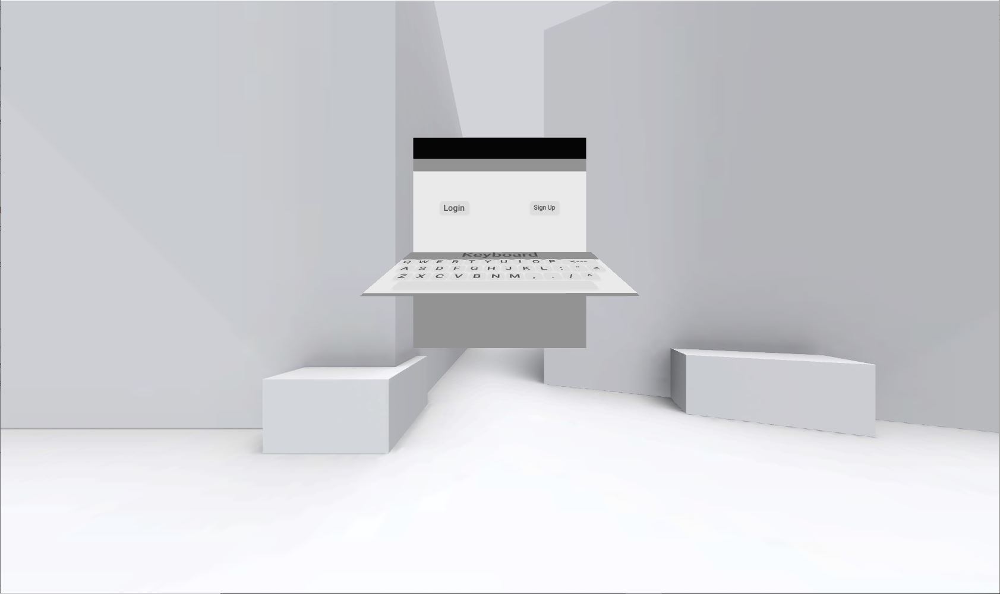
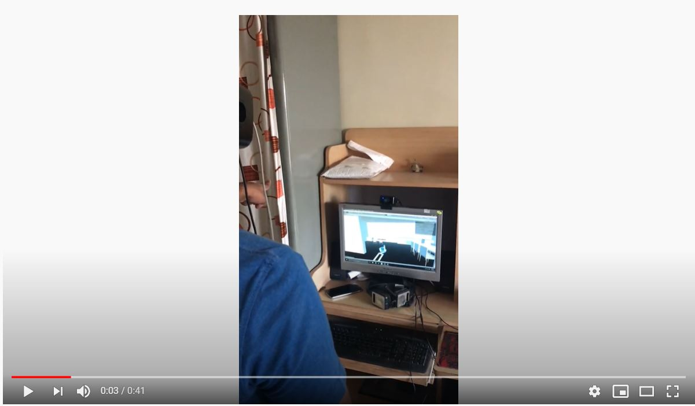

# VR-Password-Unity3D
A Unity3D based Password System where user can create their password by moving objects in virtual world.

Tech Stack:
Unity3D, C#, Leap Motion Hand Controller Library, Unity Input Interaction Engine

Hardware:
Oculus Rift DK2, Leap Motion Controller

Paper Link: http://ijste.org/Article.php?manuscript=IJSTEV4I4031

Login Scene Snapshot:

Video Implementation:

